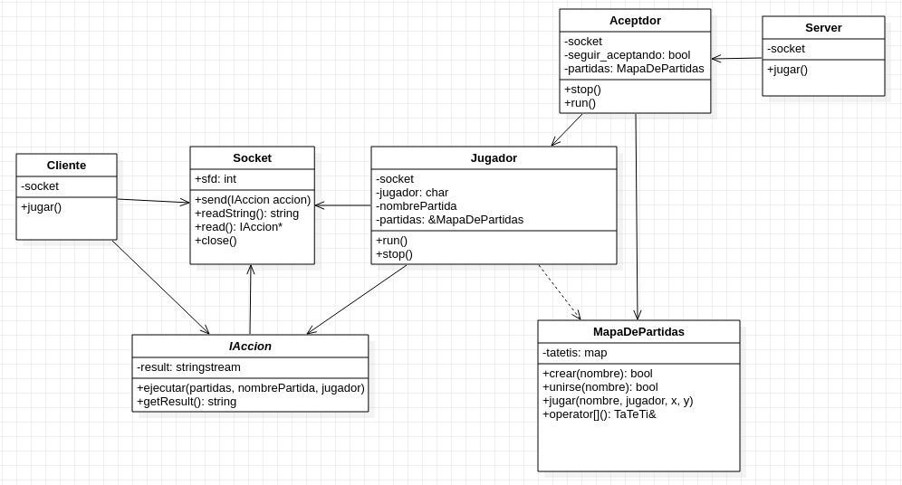

# TP3 - Ta-Te-Ti

Pablo Salvador Dimartino - 101231

Taller de Programación I (75.42) - 1º Cuatrimestre 2021

Facultad de Ingeniería

Universidad de Buenos Aires

[Link al repositorio de GitHub](https://github.com/psdimartino/TallerDeProgramacion_TP3)

## Introduccion

Para la resolución del problema se implementó una serialización y deserialización de objetos para enviarlos a travez del socket. De esta forma se pudieron transmitir las acciones con su respectiva información.

## Estructura general
En el siguiente diagrama se puede apreciar la estructura general de las relaciones entre las clases mas relevantes:

### Nuevos clientes

La clase `Aceptador` es la encargada de, cuando ingresa un nuevo cliente, aceptarlo y crear un nuevo thread para que se ejecute.

### Transmision

Para la transmisión de las acciones desde el cliente hacia el servidor se resolvio utilizar una clase abstracta del tipo `IAccion`. De esta clase heredan `Listar`, `Crear`, `Unirse` y `Jugar`. A dichas clases se les hace un *marshalling* por la clase wrapper de socket `Socket` del lado del cliente y un *unmarshalling* del lado del servidor. Luego simplemente se llama al método ejecutar, la cual realiza la implementación particular de cada una utilizando los distintos recursos.

Para realizar la implementacion del polimorfismo se utilizo las clase `std::unique_ptr`. De esta manera se respeta la estrucrua RAII.

Luego de realizar las operaciones necesarias, dichas clases guardan el resultado de la operacion en su atributo `resultado` para luego enviarlo hacia el cliente.

La limitación en el largo máximo del buffer se da a que se utilizan 2 bytes para enviar el largo del string, permitiendonos esto enviar un máximo de 2^16 - 1 = 65535 caracteres. Se decide arbitrariamente que es largo suficientemente pequeño como para dimensionarlo de manera estática.

### Logica de negocio

La clase `TaTeTi` es la encargada de encapsular la logica con respecto a una partida en particular. Esta clase almacena las jugadas, evalua el estado de la partida y puede convertir el tablero a un string que lo representa.

Dicha clase implementa el método `esperarElTurnoDelJugador(char const &jugador)`. Este método engloba la logica que sincroniza los distintos turnos entre los jugadores utilizando una `condition variable`.

La clase `MapaDepartidas` engloba la logica y proteccion de la logica relacionada a crear y unirse a partidas. Estas dos son secciones criticas que son protegidas por un mutex ya que la implementacion estandar de la clase `std::map` no asegura ser *thread safe*.

## Fuentes

Se utilizó el codigo de la clase Threads del [github](https://github.com/Taller-de-Programacion/threads/blob/master/tutorial-interactivo/03_is_prime_parallel_by_inheritance.cpp) de la materia Taller de Programación I.

Se utilizó el codigo de la clase OSError de [la presentacion de excepciones](https://raw.githubusercontent.com/Taller-de-Programacion/clases/master/manejodeerrores/bin/manejodeerrores-handout.pdf) de la materia Taller de Programación I.

